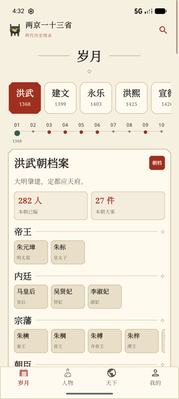
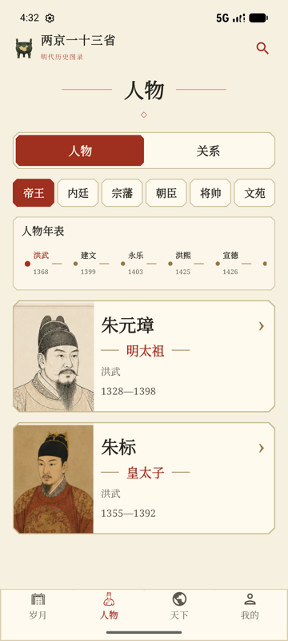
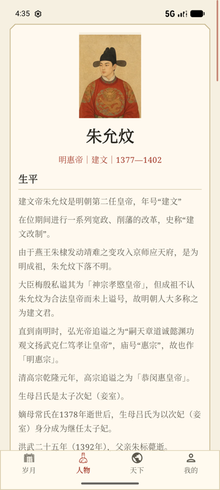
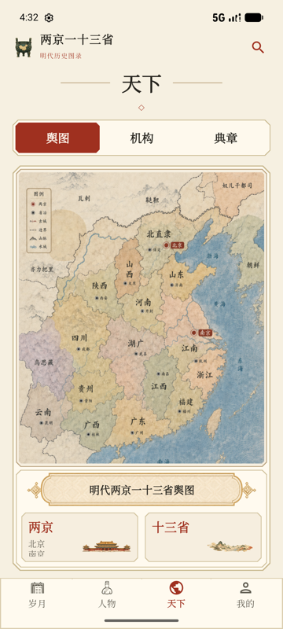
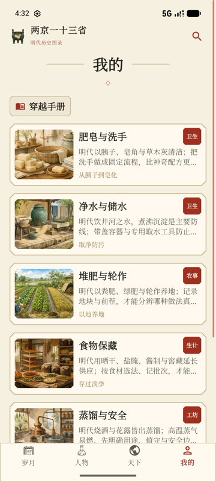

# 两京一十三省

明朝历史阅读应用（Android）：以《明史》与中文维基百科为底料的明代历史图录。应用名取自明代行政区划的俗称——两京（京师、南京）与十三布政使司。

首个发布版（versionName 1.0.0 / versionCode 10000，minSdk 24 / targetSdk 37）收录 **2,155 位明代及南明人物、18 个朝代的编年、167 件精选大事、107 条人物关系、37 个机构、48 条典章**；资料库与图片全部随 APK 打包，离线可用，客户端不访问网络。

## 一、项目与应用介绍

应用围绕四个页面组织内容：**岁月**（编年与大事）、**人物**（人物库与详情）、**天下**（舆图、机构、典章）、**我的**（穿越手册）。

| 页面 | 功能 | 界面 |
|---|---|---|
| **岁月** | 按年号浏览朝代档案：顶部年号导轨（洪武 1368—…），时间轴逐年定位，可查看本朝大事（事件介绍、相关人物、影响与出处）与当朝人物名录 |  |
| **人物** | 2,155 位人物的六分类库（帝王／内廷／宗藩／朝臣／将帅／文苑），支持人物年表按年号筛选；点入人物详情 |  |
| **人物详情** | 头部为官职·年号·年份一行；正文分「生平／家族／人物关系／相关事件」四栏，每段附出处（《明史》卷次＋维基条目），皇帝不建文武关系条目，无实料的栏目整栏隐藏 |  |
| **天下** | 明代两京一十三省舆图（省治、京城、边墙、山脉、水域图例），机构与典章（宫殿、器物与制度名物）科普卡片 |  |
| **我的** | 穿越手册：面向穿越者的生活指南（卫生、农事、生计、工坊等主题），配手绘插绘 |  |

内容规则要点：人物库只收录明朝（含南明）人物，身份经维基数据实体匹配与年代／身份兼容校验；人物六分类；生平只保留叙事性内容并附出处；「人物关系」栏只收该人物直接相关的边，不含父子／母子（归家族栏）。完整规则见 `docs/data-audit.md` 与 `docs/CONTENT_REBUILD.md`。

## 二、项目架构设计

- **前端**：Android Kotlin + Jetpack Compose，单 Activity、四页面 + 底部导航。包结构 `app/src/main/java/com/ljyss/`：`MainActivity.kt` 只保留装配与导航；`ui/{timeline,people,relationship,world,profile,components,theme}` 按功能分包；`domain/` 为无 Android 依赖的纯规则（纪年换算、生平文本、人物年序），可跑 JVM 单测；`data/` 为仓库接口与实现。依赖方向：屏 → 功能区 → `ui/components` → `domain` → `data.model`。
- **后端**：FastAPI + SQLite 内容服务，用于编辑与开发核对，不作为客户端的运行时依赖；`backend/app/` 服务代码、`backend/scripts/` 数据管线、`backend/tests/` 测试。
- **数据流**：内容真相 `backend/data/content/*.jsonl`（按表一行一条，进版本库）→ 导入 `ming_history.sqlite3`（编辑库，本地产物）→ 投影 19 张阅读端表 → 打包为 APK asset → 首启复制到私有目录供离线读取。

目录树：

```
ljysss/
├── app/            Android 客户端（Kotlin + Gradle；界面按功能分包，资源在 res/）
├── backend/        内容服务（FastAPI + SQLite）与数据管线
│   ├── app/        服务代码（catalog / database / main）
│   ├── data/content/*.jsonl   版本库真相：按表一行一条
│   ├── data/ming_history.sqlite3  本地运行产物（gitignore，可重建）
│   ├── scripts/    导入、审计、发布库投影脚本
│   ├── sources/    原始权威数据包（uchg 保护，禁止删除）
│   └── tests/      后端测试（pytest）
├── docs/           接口契约、数据规则、界面截图（docs/images/）等
├── tmp/            QA 截图等临时产物（gitignore，禁止提交）
├── gradle/         Gradle wrapper 等工程文件
├── build.gradle.kts / settings.gradle.kts / gradlew*   Gradle 工程根（AGP 固定布局）
└── AGENTS.md       项目协作约定（先读）
```

## 三、开发与运行环境

**Android**：JDK 17+、Android SDK（compileSdk 37 / minSdk 24 / targetSdk 37）、Gradle 9.5 wrapper（保持锁定，不随 lint 提示升级）。构建调试包：

```bash
./gradlew assembleDebug
# 输出：app/build/outputs/apk/debug/app-debug.apk
```

**后端**：Python 3.9+。首次克隆后：

```bash
cd backend
python3 -m venv .venv
.venv/bin/pip install -r requirements.txt   # fastapi、uvicorn
.venv/bin/uvicorn app.main:app --reload --port 8000
```

模拟器联调（内容服务经 adb 反代到设备）：

```bash
~/Library/Android/sdk/platform-tools/adb reverse tcp:8000 tcp:8000
~/Library/Android/sdk/platform-tools/adb install -r app/build/outputs/apk/debug/app-debug.apk
```

**测试与静态检查**：

```bash
cd backend && .venv/bin/python -m pytest tests/ -q   # 后端测试
./gradlew :app:testDebugUnitTest                      # domain JVM 单测
./gradlew :app:lintDebug                              # lint
```

**发布**：release 构建启用 R8 代码压缩与资源收缩；签名密钥与密码不进入版本库，通过下列环境变量提供（密钥生成方式：`keytool -genkeypair` 存 `~/.android/ljyss-release.p12`，变量文件 600 权限）：

```bash
export LJYSS_RELEASE_STORE_FILE=/path/to/release.p12
export LJYSS_RELEASE_STORE_PASSWORD=…
export LJYSS_RELEASE_KEY_ALIAS=…
export LJYSS_RELEASE_KEY_PASSWORD=…
./gradlew :app:assembleRelease :app:bundleRelease
```

可安装包输出在 `app/build/outputs/apk/release/app-release.apk`（签名证书 CN=两京一十三省）；应用商店上传包输出在 `app/build/outputs/bundle/release/app-release.aab`。

协作约定见 `AGENTS.md`；接口契约见 `docs/backend-api-contract.md`。
